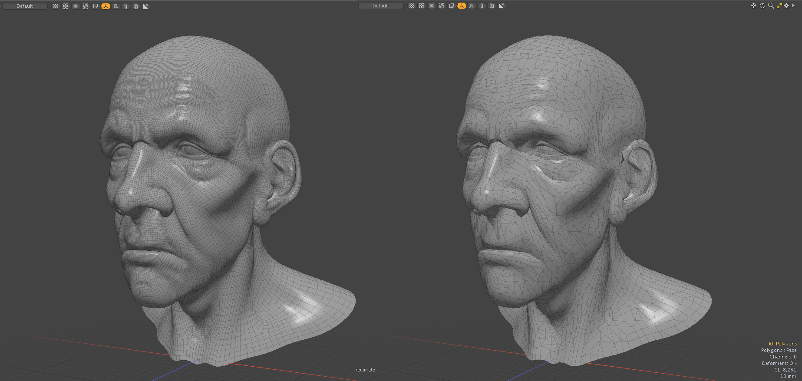
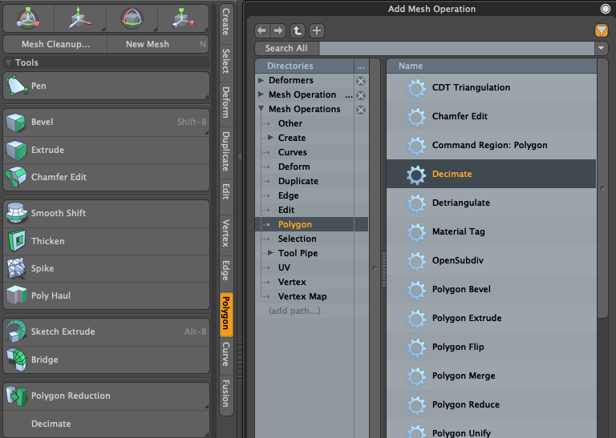

# Mesh Decimation tools for Modo plug-in
This is a Modo Plug-in kit to simplify mesh by collapsing edges using [CGAL](https://cgal.org) Triangulated Surface Mesh Simplication.

This kit contains a direct modeling tool and a procedural mesh operator for Modo macOS and Windows.


<div align="left">

</div>
Left: Original mesh (82296 edges, 41056 polygons), Right: Lindstrom-Turk cost strategy with 10% ratio (10861 edges, 6659 polygons)


## Installing
- Download lpk from releases. Drag and drop into your Modo viewport. If you're upgrading, delete previous version.

## How to use Decimation tool
- The tool version of Skeleton can be launched from "Decimate" button on Polygon tab of Modo ToolBar on left.
- The procedural mesh operator version is available on Mesh Operator viewport. That is categorized in Polygon tab.
<div align="left">

</div>

## Mode<br>
**Mode** is how to set stop predicate to CGAL edge_collapse function. **By Ratio** specifies the stopping condition of the process based on the ratio of the number of edges after collapsing to the total number of edges. **By Count** specifies the number of edges to collapse before the process stops. The Decimate plugin triagulates the target polygons in pre-process. **Ratio** is for the triangles, so the resulting polygon count will not exactly match the ratio.<br><br>

## Cost Strategy<br>
**Cost Strategy** is the the algorithm how to collapse edges. The specific way in which the collapse cost and vertex placement is calculated is called the cost strategy. The user can choose different strategies in the form of policies and related parameters, passed to the algorithm. This kit provides a set of policies implementing three strategies: **Lindstrom-Turk** strategy, which is the default, **Garland-Heckbert** family of strategies, and a strategy consisting of an **Edge-Length** cost with an optional midpoint placement (much faster but less accurate).<br><br>

## Preserve Boundary, Preserve Material Border<br>
These options set constrained edges to CGAL edge_collapse function. **Preserve Boundary** is for edges on opened polygon boundary. **Preserve Material Border** sets edges when the shared two polygons have different material tags. All locked edges are set as constrained edges.<br><br>

## Dependencies

- LXSDK  
This kit requires Modo SDK (Modo 16.1v8 or later). Download and build LXSDK and set you LXSDK path to LXSDK_PATH in CMakeLists.txt in triagulate.
- CGAL library 6.0.1 (https://github.com/cgal/cgal)  
This also requires CGAL library. Download and CGAL from below and set the include and library path to CMakeLists.txt in triagulate.
- Boost 1.87.0 (https://www.boost.org/)
- GMP 6.3.0 (https://gmplib.org/)
- MPFR 4.2.1 (https://https://www.mpfr.org/)

If they are not set, the project files are downloaded automatically via FetchContent of cmake

## License

```
This software is based part on CGAL (The Computational Geometry Algorithms Library):
Licensed under the GPL-3.0 license.
https://cgal.org
```
